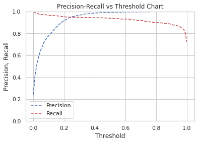

# predict-hr-stay-or-leave

Here [HR Analytics](https://www.kaggle.com/giripujar/hr-analytics) dataset by [Giri Pujar](https://www.kaggle.com/giripujar) is used to create a classifier if a `HR` will stay or leave.

Using the `unbalanced dataset` of employees of the company to predict which employee might stay or leave the company. `SMOT` is used to deal with the unbalanced dataset. `SMOTE` (synthetic minority oversampling technique) is one of the most commonly used `oversampling` methods to solve the imbalance problem.

Also `recursive feature elimination` and `feature elimination` techniques are used for `feature engineering`.

## Table of contents

- [Getting started](#getting-started)
- [Findings](#findings)
- [Model performance](#model-performance)
- [License](#license)

## Getting started

The [notebook](https://www.kaggle.com/akashsdas/predict-hr-stay-or-leave) is available on Kaggle to work in the same environment where this notebook was created i.e. use the same version packages used, etc...

## Findings

**Count plot to visualize how much our data is imbalanced**

**Correlation matrix**

## Model performance

**Learning curve**

**Confusion matrix**

**AUC - ROC curve**

**Precision-Recall vs Threshold Chart**

## License

[APACHE LICENSE, VERSION 2.0](./LICENSE)
